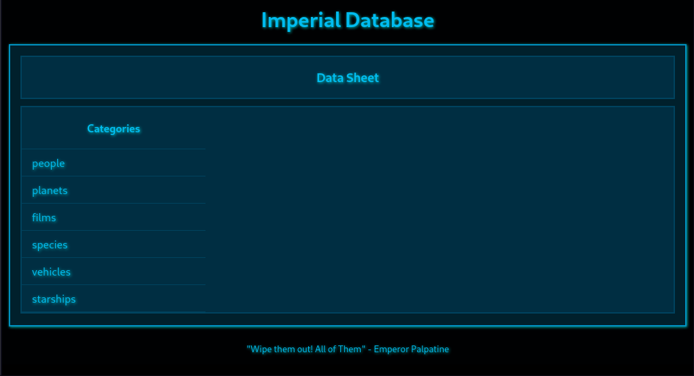
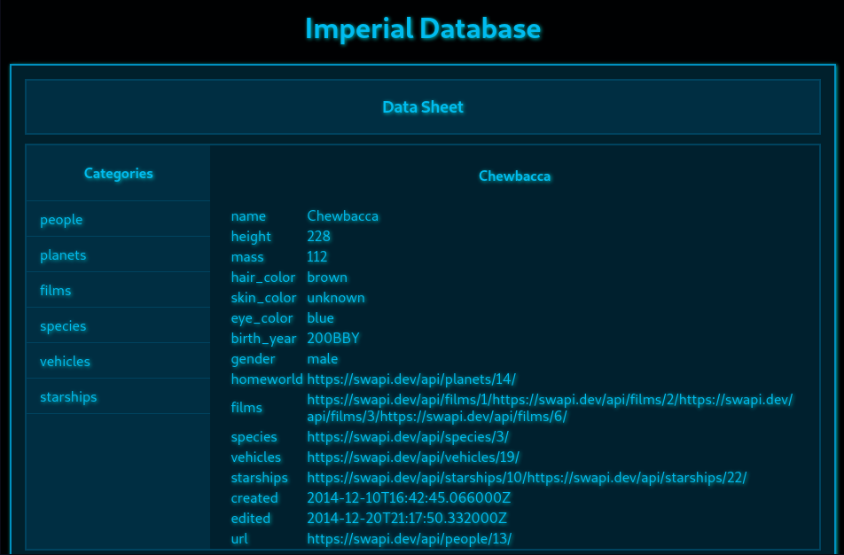
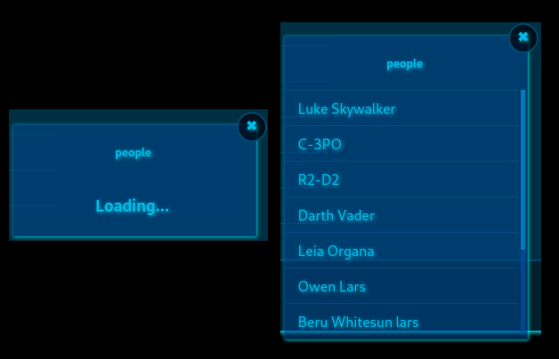
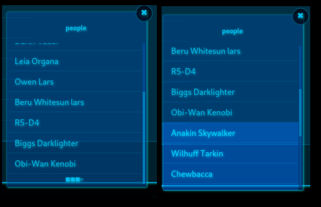

# Imperial Database

A simple React UI for navigating the Star Wars REST API.

This demonstrative project includes first and second layer navigation through the REST API endpoint provided at the Star Wars API. Deeper navigation layers appear as direct urls to the corresponding resources. For the sake of this demonstration, these external urls are non-clickable.

Star Wars API is moved to [https://swapi.dev](https://swapi.dev).

## Implemented Features

### Dynamic Loading using Fetch API

All data is loaded from the Star Wars API using the default Fetch API. Since the browser's default behavior is to challenge CORS, requests are instead channelled through the server to meet the CORS security requirements.

### Scroll Paging

Entity lists are paged for efficient loading. Once the user reaches the bottom of the list, a loader appears, and a request is raised to get and append the next page from the server. This behavior is repeated until there are no unloaded pages left.

## Available Scripts

In the project directory, you can run:

### `npm start`

Runs the app in the development mode.\
Open [http://localhost:3000](http://localhost:3000) to view it in the browser.

The page will reload if you make edits.\
You will also see any lint errors in the console.

### `npm test`

Launches the test runner in the interactive watch mode.\
See the section about [running tests](https://facebook.github.io/create-react-app/docs/running-tests) for more information.

### `npm run build`

Builds the app for production to the `build` folder.\
It correctly bundles React in production mode and optimizes the build for the best performance.

The build is minified and the filenames include the hashes.\
Your app is ready to be deployed!

See the section about [deployment](https://facebook.github.io/create-react-app/docs/deployment) for more information.

### `npm run eject`

**Note: this is a one-way operation. Once you `eject`, you can’t go back!**

If you aren’t satisfied with the build tool and configuration choices, you can `eject` at any time. This command will remove the single build dependency from your project.

Instead, it will copy all the configuration files and the transitive dependencies (webpack, Babel, ESLint, etc) right into your project so you have full control over them. All of the commands except `eject` will still work, but they will point to the copied scripts so you can tweak them. At this point you’re on your own.

You don’t have to ever use `eject`. The curated feature set is suitable for small and middle deployments, and you shouldn’t feel obligated to use this feature. However we understand that this tool wouldn’t be useful if you couldn’t customize it when you are ready for it.
